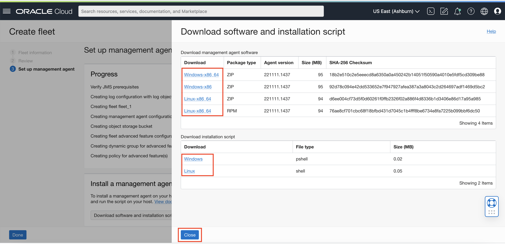
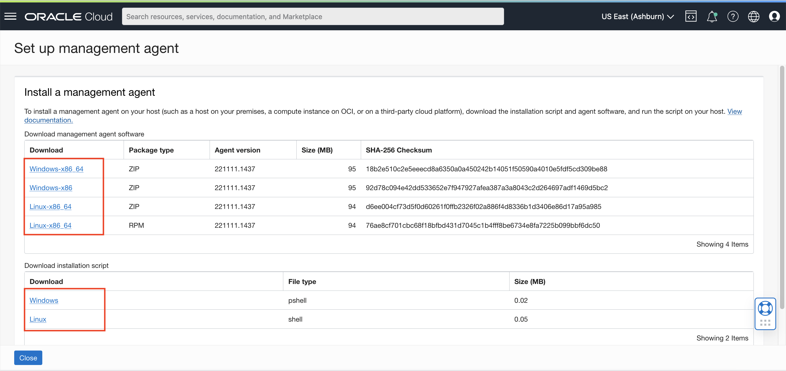

# Understand concepts related to Management Agent installation

## Introduction

This lab walks you through the key concepts that need to be understood before installing a management agent on your compute instance Managed Instance as part of the set up for Java Management Service (JMS) on Oracle Cloud Infrastructure (OCI).

Estimated Time: 15 minutes

### Objectives

In this lab, you will:

- Understand important concepts in preparation for installation of Management Agents on a host (also known as a Managed Instance in JMS). A Managed Instance can be any computer running in your enterprise. In most cases, the Managed Instance is a computer on your premises, but it can be a compute instance on OCI or on any other cloud platform.

### Prerequisites
- You have signed up for an account with Oracle Cloud Infrastructure and have received your sign-in credentials.
- You are using an Oracle Linux image or Windows OS on your Managed Instance for this workshop.
- Access to the cloud environment and resources configured in [Lab 2](?lab=setup-a-fleet).

## Task 1: Understand Concepts related to Management Agent installation

Before the set up of the Management Agent, it is important to understand the concepts behind the Java Management Service:

- **Java Management Service (JMS)**: A reporting and management infrastructure integrated with Oracle Cloud Infrastructure Platform services to observe and manage your use of Java SE (on-premises or in the Cloud) in your enterprise.

- **Management Agents**: Can be installed on a Managed Instance to allow a service plug-in to collect data from the Managed Instance where you installed the Management Agent. In the case of JMS, the management agent allows the JMS plug-in to collect data about Java Applications, Java Runtimes and Installations from the Managed Instance which can be either on-premises or OCI Compute Instance Managed Instances or from other cloud providers.

- **Java Usage Tracking plugin**: A Service Plugin allows Management Agents to interact with data sources and send the data back to the cloud service. In the case of the Java Usage Tracking service plugin, data about Java Applications, Java Runtimes and Installations is collected from the Managed Instance which can be either on-premises or from other cloud providers.

  

- **Java Management Service plugin**: A Service Plugin responsible for enabling Java runtime Lifecycle Management, which is an advanced feature of JMS. This workshop will focus on the basics of JMS. If you would like to learn more about the Lifecycle Management feature, you may refer to [Perform Java Lifecycle Management with Java Management Service](https://apexapps.oracle.com/pls/apex/dbpm/r/livelabs/view-workshop?wid=3202).

  Java Management Service plugin is deployed in different ways on OCI and non-OCI Managed Instances. On non-OCI Managed Instances, it is deployed through Management Agent, and can be found under Observability & Management -> Management Agent -> Agents -> Deploy plug-ins. On OCI Managed Instances, it is deployed through Oracle Cloud Agent (OCA), and can be found under Compute -> Instances -> Oracle Cloud Agent.

  **On non-OCI Managed Instances:**
  

  **On OCI Managed Instances:**
  

- **Installation Script**: JMS provides an installation script that you can use to set up management agents using a single command. The script has been automatically generated for you in [Lab 2](?lab=setup-a-fleet). 
  
  The script does the following functions:
    - Install the Management Agent software.
    - For non-OCI instances, the **Management Agent** software needs to be downloaded (download management agent software) and placed in the same directory as the **Installation Script**
    - Configure the agent with the specific key for the fleet.
    - Install JMS plugins for Java runtime discovery and usage reporting and Lifecycle management operations.
    - Configure the usage tracker.

  Download when creating a fleet:

  

  Download in the fleet details page:

  

  

  You may now **proceed to the next lab.**

## Learn More

* Refer to the [Management Agent Concepts](https://docs.oracle.com/en-us/iaas/management-agents/doc/you-begin.html),
  [Configuring a Management Agent on an OCI Compute Instance](https://docs.oracle.com/en-us/iaas/jms/doc/agent-management.html) and [Installation of Management Agents](https://docs.oracle.com/en-us/iaas/management-agents/doc/install-management-agent-chapter.html) sections of the JMS documentation for more details.

* Use the [Troubleshooting](https://docs.oracle.com/en-us/iaas/jms/doc/troubleshooting.html#GUID-2D613C72-10F3-4905-A306-4F2673FB1CD3) chapter for explanations on how to diagnose and resolve common problems encountered when installing or using Java Management Service.

* If the problem still persists or it is not listed, then refer to the [Getting Help and Contacting Support](https://docs.oracle.com/en-us/iaas/Content/GSG/Tasks/contactingsupport.htm) section. You can also open a support service request using the **Help** menu in the OCI console.

## Acknowledgements

- **Author** - Xin Yi Tay, Java Management Service
- **Last Updated By** - Bao Jin Lee, November 2022
